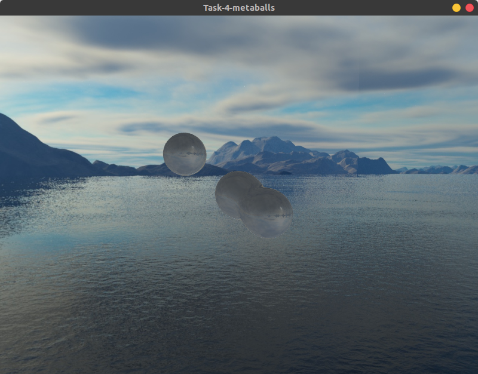

# GPU metaballs marching cubes

### Условие
Динамические metaball'ы c отражением и преломлением

## Запуск 
Собираем проект:
1) Windows `build.bat` 
2) Linux `build.sh`

Далее запускаем `build/Task-4-metaballs`

## Примеры

