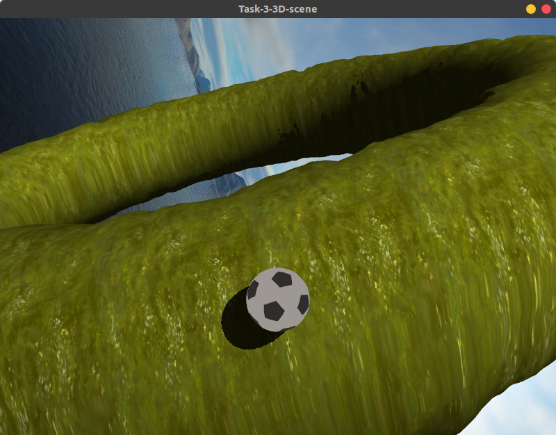
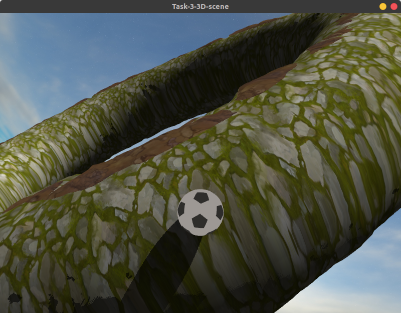

# 3D сцена

### Торическая земля:
- **Ландшафт** (max 1.25)
    - Генерируется по карте высот (позиции вершин, нормали и текстурные координаты) (0.5)
    - Текстурируется набором тайлов (0.25)
        - переключение по высоте/нормали либо по карте материалов (+0.25)
        - detail текстура при приближении (+0.25)
- **Торический ландшафт** (1)
    - Карта высот применяется к тору, как к базовой поверхности.
- **Управляемая 3D модель** (1/1.25)
    - Перемещается по поверхности торического ландшафта
    - Ориентирована по карте высот
    - "Приклеена" к карте высот
    - Камера крепится к модели
        - "Пружинная" камера (+0.25)
- **Источники света** (0.25/1.25)
    - Фары/источник света, связанный с объектом, без теней (0.25)
    - Направленный (солнце) + тени
        - без каскадов (только объекта на ландшафт) (0.5)
        - с каскадами (тени от ландшафта и объекта с самозатенением) (1)

## Запуск 
Собираем проект:
1) Windows `build.bat` 
2) Linux `build.sh`

Далее запускаем `build/Task-3-3Dscene`

## Примеры

